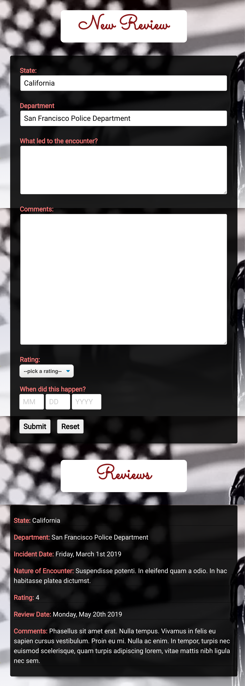
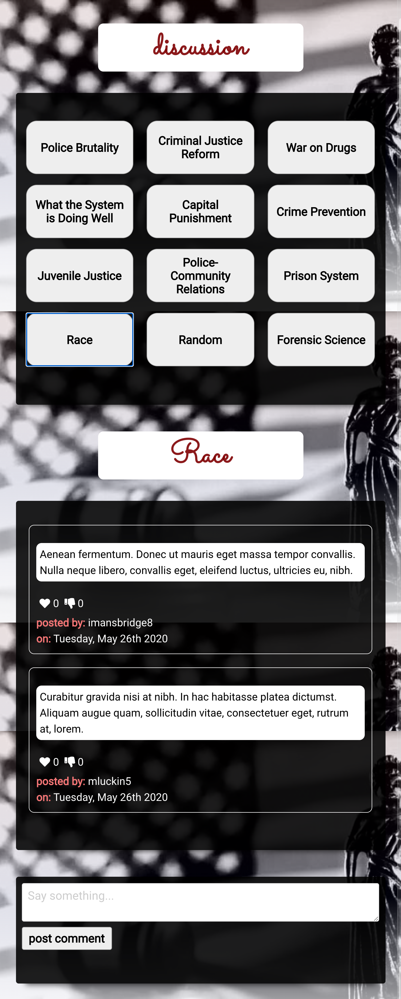

# Hearsay 

[Live App](https://hearsay-app.rmac2289.now.sh/)

---
## Summary

Hearsay is a web app designed to allow users to review encounters with law enforcement. The app asks the user for information about their encounter and an explanation concerning how they felt the encounter went. Hearsay also includes a discussion board with various topics across the criminal justice field where users can express their opinions.

---

## API Documentation

### API Root 
https://fierce-cliffs-47097.herokuapp.com/api

A bearer token is required for use of the API. The token can be acquired through registering with a username and password via the register link on the navigation bar.

### API Endpoints

The API has multiple endpoints:
- /login
    The authentication endpoint called when the user attempts to login. Will authenticate
    username and password and either log the user in or provide 'incorrect username or password' response.
- /reviews
    Accepts GET and POST requests. Reviews endpoint is called when the user attempts to 
    either post a review or to view current reviews.
- /users
    Accepts POST request. The users endpoint is called when a new user is attempting registration. 
- /discussion
    Accepts GET and POST requests. Discussion endpoint is called when the user clicks on a discussion topic or attempts to post a comment to that discussion.
- /discussion/topics
    Accepts GET request. Topics endpoint is called whenever the user navigates to the discussion/forum page. 

---

## Screenshots
#### Home Page

#### Reviews

#### Discussion

---

## Technologies

### Codebase
[React](https://reactjs.org/)
[Node.js](https://nodejs.org/en/)
[PostgreSQL](https://www.postgresql.org/)
[Express](https://expressjs.com/)
[Knex](http://knexjs.org/)
[JWT](https://jwt.io/)

### Test
[Mocha](https://mochajs.org/)
[Chai](https://www.chaijs.com/)
[Supertest](https://www.npmjs.com/package/supertest)

### Deployment
[Heroku](https://dashboard.heroku.com/)
[GitHub(client)](https://github.com/rmac2289/hearsay-app)
[Github(server)](https://github.com/rmac2289/hearsay-server)
[Zeit/Vercel](https://vercel.com)

